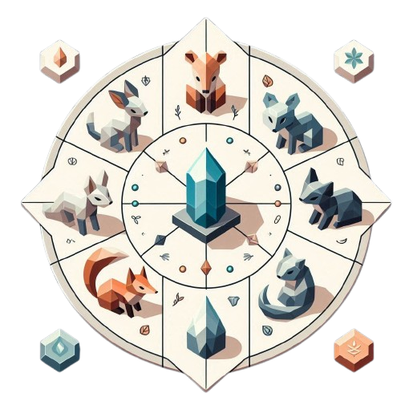

# 
 **Les Échos de Xérath**

  

## Sommaire

- [I - Histoire](#i---histoire)
    - [Introduction](#introduction-et-contexte-)
    - [Phase 1](#phase-1---exploration-du-village-)
    - [Phase 2](#phase-2---premiers-indices-et-fragments-)
    - [Phase 3](#phase-3---quête-des-fragments-)
    - [Phase 4](#phase-4---révélation-au-temple-)
    - [Phase 5](#phase-5---retour-dans-le-village-et-la-découverte-de-la-vérité-)
    - [Révélation](#révélation-)
    - [Morale](#morale-)
- [II - Fonctionnement](#ii-fonctionnement)
- [III - Répartition](#iii---répartition)
- [IV - Crédits](#iv---crédits)

## Synopsis :
Vous vous réveillez dans une petite maison au cœur d’un village étrange, votre mémoire embrouillée et un journal de bord à vos côtés. Sur la première page, une seule phrase attire votre attention :

"Étant le seul épargné, je dois désactiver la malédiction de Xérath pour sauver les habitants."

En sortant de la maison, vous découvrez un village peuplé d’animaux qui se comportent comme des humains : un chat aux lunettes plongé dans un livre, un chien jouant de la musique... Mais aucun ne semble vous reconnaître, vous traitant comme un inconnu.

**Exploration et découverte :**
Intrigué, vous explorez le village et apprenez l’existence de la grotte de Xérath, un lieu ancien et mystique où la malédiction semble avoir pris racine. À l’intérieur de la grotte, vous découvrez un cristal brisé, incomplet. Un habitant du village vous offre un fragment de pierre qu’il a trouvé, et vous comprenez que d’autres morceaux sont éparpillés dans le village et ses environs.

**Quête des fragments :**
Vous arpentez les lieux emblématiques du village – un lac scintillant, un immense arbre central, et d’autres endroits enchanteurs – à la recherche des fragments manquants. À chaque découverte, le mystère se dévoile un peu plus, et la grotte semble vous appeler, comme pour révéler un secret enfoui.

**Révélation :**
Une fois le cristal reconstitué, vous retournez dans la grotte de Xérath. Dès que vous placez le dernier fragment, une lumière aveuglante vous enveloppe. Lorsque vous reprenez vos esprits, vous réalisez que vous avez changé : vous êtes devenu l’un des animaux du village, une créature semblable à ceux que vous tentiez de sauver.

De retour au village, les habitants vous accueillent chaleureusement, vous appelant par un nouveau nom et semblant vous reconnaître. Peu à peu, vous comprenez que la malédiction ne pesait pas sur eux, mais sur vous. Vous aviez été transformé en humain, perdu votre mémoire, et oublié que c’était votre propre humanité que vous cherchiez à retrouver.

**Morale :**
Vous choisissez d’accepter votre nouvelle forme et de vivre parmi les villageois, réalisant que la valeur et la "normalité" d’un être ne dépendent pas de son apparence, mais de sa capacité à nouer des relations sincères et à trouver le bonheur.

Ainsi, vous apprenez que la perfection que vous recherchiez n’était qu’une illusion et que l’acceptation de soi est la véritable clé de la paix intérieure.

## II Fonctionnement

### Tiled

### Pygame

### Python

## III - Répartition

### Karl

*  *Assets

### Luna

* *Readme*
* *Assets*

### Erika

* *Assets*

   
## IV - Crédits

| Noms                         |                Adresses Mails |
| :-----------------------     |      -----------------------: |
|**Luna COLOMBAN-FERNANDEZ**   |luna.colombanfernandez@ynov.com|
|**Erika LAJUS**               |erika.lajus@ynov.com           |
|**Karl DAVAL-LECLERCQ**       |karl.davalleclercq@ynov.com    |